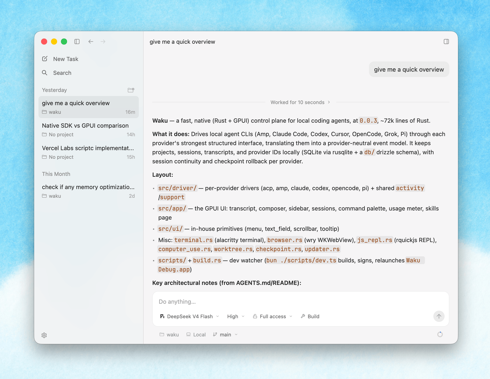

<p align="center">
  <picture>
    <source media="(prefers-color-scheme: dark)" srcset="website/public/padu.svg">
    
  </picture>
</p>

<p align="center">
  <em>One native app for all your coding agents.</em>
</p>

<p align="center">
  <a href="https://github.com/wisnuwiry/padu/stargazers"></a>&nbsp;
  <a href="https://github.com/wisnuwiry/padu/blob/main/LICENSE"></a>&nbsp;
  <a href="https://github.com/wisnuwiry/padu/releases/latest"></a>&nbsp;
  <a href="https://rustc-hash.vercel.app/"></a>
</p>

<p align="center">
  <a href="#overview">Overview</a>&nbsp;·
  <a href="#supported-agents">Agents</a>&nbsp;·
  <a href="#highlights">Highlights</a>&nbsp;·
  <a href="#architecture">Architecture</a>&nbsp;·
  <a href="#development">Development</a>&nbsp;·
  <a href="#license">License</a>
</p>

---

> **Notice**: Padu is a fork of [Waku](https://github.com/egoist/waku), originally created by [egoist](https://github.com/egoist), licensed under GPL-3.0. See [NOTICE.md](NOTICE.md) for full attribution and details.

## Overview

Padu is a fast, native desktop app for working with local coding agents. Built
in Rust with [GPUI](https://github.com/zed-industries/zed/tree/main/crates/gpui),
it keeps projects, sessions, and transcripts entirely on your machine.

<picture>
  <source media="(prefers-color-scheme: dark)" srcset="website/public/app-screenshot-dark.png">
  
</picture>

## Install

Padu is available for **Linux**, **macOS** (ad-hoc), and **Windows**.

### Linux

```sh
curl -fsSL https://padu.dev/install.sh | sh
```

Installs to `~/.local/padu.app` — no root, no package manager.

### macOS (ad-hoc)

```sh
# Download the latest DMG from GitHub Releases:
# https://github.com/wisnuwiry/padu/releases/latest
#
# Or via terminal:
curl -LO https://github.com/wisnuwiry/padu/releases/latest/download/Padu-0.1.0.dmg
open Padu-0.1.0.dmg
```

> ⚠️ **Ad-hoc signed** — no Apple Developer account needed. The first time you
> open it, macOS will show a Gatekeeper warning. **Right-click → Open** the
> app (or go to System Settings → Privacy & Security → Open Anyway) to bypass
> it. This is only needed once.

### Windows

```sh
# Download the latest installer from GitHub Releases:
# https://github.com/wisnuwiry/padu/releases/latest
#
# Or via PowerShell:
irm https://github.com/wisnuwiry/padu/releases/latest/download/Padu-0.1.0-x86_64-Setup.exe -OutFile $env:TEMP\Padu-Setup.exe
Start-Process $env:TEMP\Padu-Setup.exe
```

> ℹ️ The installer is **per-user** (\`%LOCALAPPDATA%\Programs\Padu\`) — no
> admin rights needed. SmartScreen may show a warning; click **Run anyway**
> to proceed.

## Supported agents

Padu works with:

- [Amp](https://ampcode.com/)
- Claude Code
- Codex CLI
- Cursor CLI
- [Fx](https://fx.sh/)
- Grok Build
- Kimi Code
- OpenCode
- Pi

Install and authenticate at least one supported agent CLI before starting Padu.
Padu detects available CLIs automatically and uses each provider's native
structured protocol and session continuity.

## Highlights

- **Unified workspace** — Keep projects and independent agent sessions in one
  native app.
- **Shared controls** — Switch models, reasoning effort, and access modes from
  a single interface.
- **Queue & steer** — Send follow-up messages while an agent is still working.
- **Rewind** — Git-backed task history with conversation-aware checkpoints.
- **Local-first** — Everything stays on your machine. No Padu account or remote
  service required.

## Architecture

The native desktop is an RPC client of the standalone `padu-daemon` process.
Provider sessions run in [`padu-core`](crates/padu-core), behind the
authenticated, versioned WebSocket contract in
[`padu-protocol`](crates/padu-protocol). Padu Desktop depends on
[`padu-client`](crates/padu-client), not on the daemon implementation. The
daemon owns task SQLite data, uploaded attachments, provider-native session
forks, and all workspace filesystem and Git operations; paths returned by it
always refer to the daemon host. The desktop retains only presentation state
and a disposable preview cache.

The browser client lives at [`apps/web`](apps/web) and uses the generated
browser transport in [`packages/padu-client`](packages/padu-client). Its
checked-in types are generated directly from the Rust protocol, while its
WebSocket client implements the same handshake, request IDs, subscriptions,
sequence deduplication, and replay cursors as the Rust client. Run
`bun run protocol:generate` after changing a wire type and
`bun run protocol:check` to verify that generated files are current.

Projectless task workspaces live on the daemon host under
`~/.padu/projects/<date>/<slug>`. The daemon moves workspaces created by the
older `~/.padu/<date>/<slug>` layout on first load.

Configuration ownership is separate too: the Release desktop writes
`~/.padu/app.json`, while Debug stays isolated at `temp/app.json`. Daemon
provider and Computer Use settings live in `~/.padu/settings.json`. The
desktop's Settings → Daemon page can explicitly
expose the child daemon on a fixed port, configure exact browser origins, and
copy its stable authentication token. It remains loopback-only by default.

When connected to a daemon managed outside the desktop process, Padu never
interprets daemon paths on the client machine. The local folder picker and PTY
are therefore unavailable until the protocol gains daemon-host picker and
terminal-stream endpoints; files, diffs, Git, skills, usage, task state, and
attachments already use daemon RPC.

Release apps bundle and sign `padu-daemon`. Development keeps the daemon at
`target/debug/padu-debug-daemon`, allowing provider-only edits to rebuild and
replace the daemon without relaunching Padu Debug.

## Development

Development is supported on macOS, Linux, and Windows and requires
[Rust 1.96 or newer](https://www.rust-lang.org/tools/install) and
[Bun](https://bun.sh/). Linux supports both Wayland and X11, and Windows needs
the MSVC toolchain; install the native build prerequisites listed in
[CONTRIBUTING.md](CONTRIBUTING.md) first.

```sh
bun install
bun run dev
```

The embedded browser and experimental computer-use integration currently
remain macOS-only. Agent sessions, projects, transcripts, skills, usage,
diffs, file editing, and the terminal run natively on Linux and Windows.

See [CONTRIBUTING.md](CONTRIBUTING.md) for the development workflow and checks.
Release maintainers should also read [RELEASING.md](RELEASING.md).

## Sponsorship

You can support the project development via
[GitHub Sponsors](https://github.com/sponsors/wisnuwiry).

## License

Padu is licensed under the [GNU General Public License v3.0 only](LICENSE).
See [NOTICE.md](NOTICE.md) for full license attribution and details.